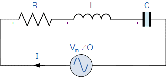

### Introduction

A resonant circuit consists of R, L, and C elements and whose frequency response characteristic changes with changes in frequency. A resonant frequency is defined as the natural frequency of a system where it oscillates at the greatest amplitude. A system is said to be in resonance when an external force applied shares the same frequency as its natural frequency.

In daily life, you’ll come across mechanisms that resonate at their resonant frequency, which results in greater amplitude. Besides bridges, swings, string instruments, and RLC circuits are also known to exhibit extraordinary behaviour at their resonant frequencies. 

For example, if a swing is pushed at its resonant frequency, it results in the swing reaching greater heights than it would otherwise. The strings of a musical instrument interact with each other in a similar way. In electronics, you’ll come across resonant frequencies, particularly in RLC circuits.

### Resonant Frequency in a Series RLC Circuit

 

Fig.1 Series RLC circuit 
 

The series RLC circuit depicted above is commonly used in various PCB applications. Both inductor and capacitor display dynamic properties in reactance across a different range of frequencies. 
At a specific frequency, the inductive reactance and the capacitive reactance will be of equal magnitude but in opposite phase. They are represented by the equation: 

 $ X_L = X_C $  

As both capacitive and inductive reactance cancel each other out, the circuit’s impedance will be purely resistive. When this phenomenon occurs, the circuit is said to be oscillating at its resonant frequency. The resonant frequency of the series RLC circuit is expressed as  

 $ f_r = \frac{1}{{2\pi\sqrt{LC}}} $ 
  

At its resonant frequency, the total impedance of a series RLC circuit is at its minimum. It also means that the current will peak at the resonant frequency as both inductor and capacitor appear as a short circuit.

  

 
 Fig.2 Resonance frequency vs Current 
  

A series RLC circuit, which achieves maximum power transfer at resonance, is commonly used as a bandpass filter for radio, TV, or as a noise filter. 

In a Series Resonance RLC circuit there becomes a frequency point were the inductive reactance of the inductor becomes equal in value to the capacitive reactance of the capacitor. In other words, XL = XC. The point at which this occurs is called the Resonance Frequency point, (ƒr) of the circuit, and as we are analysing a series RLC circuit this resonance frequency produces a Series Resonance.

Series Resonance circuits are one of the most important circuits used electrical and electronic circuits. They can be found in various forms such as in AC mains filters, noise filters and also in radio and television tuning circuits producing a very selective tuning circuit for the receiving of the different frequency channels. Consider the simple series RLC circuit below.

 

Fig.3 Circuit diagram of Series RLC 
 

 

From the above equation for inductive reactance, if either the Frequency or the Inductance is increased the overall inductive reactance value of the inductor would also increase. As the frequency approaches infinity the inductors reactance would also increase towards infinity with the circuit element acting like an open circuit. 

However, as the frequency approaches zero or DC, the inductors reactance would decrease to zero, causing the opposite effect acting like a short circuit. This means that inductive reactance is “Proportional” to frequency and is small at low frequencies and high at higher frequencies and this demonstrated in the fig. 4 

### Inductive Reactance against Frequency 

 

 
Fig.4 Inductive reactance vs Frequency  
 

The graph of inductive reactance against frequency is a straight line linear curve. The inductive reactance value of an inductor increases linearly as the frequency across it increases. Therefore, inductive reactance is positive and is directly proportional to frequency (XL ∝ ƒ). 

The same is also true for the capacitive reactance formula above but in reverse. If either the Frequency or the Capacitance is increased the overall capacitive reactance would decrease. As the frequency approaches infinity the capacitors reactance would reduce to practically zero causing the circuit element to act like a perfect conductor of 0Ω. 

But as the frequency approaches zero or DC level, the capacitors reactance would rapidly increase up to infinity causing it to act like a very large resistance, becoming more like an open circuit condition. This means that capacitive reactance is “Inversely proportional” to frequency for any given value of capacitance and this shown below in Fig. 5 

### Capacitive Reactance against Frequency

  

 Fig.5 Capacitive reactance vs Frequency 
  

The graph of capacitive reactance against frequency is a hyperbolic curve. The Reactance value of a capacitor has a very high value at low frequencies but quickly decreases as the frequency across it increases. Therefore, capacitive reactance is negative and is inversely proportional to frequency (XC ∝ ƒ -1). 

We can see that the values of these resistances depends upon the frequency of the supply. At a higher frequency XL is high and at a low frequency XC is high. Then there must be a frequency point were the value of XL is the same as the value of XC. 

If we now place the curve for inductive reactance on top of the curve for capacitive reactance so that both curves are on the same axes, the point of intersection will give us the series resonance frequency point, (ƒr or ωr) as shown below.

  

 Fig.6 Reactance vs Resonance frequency 
 

where: ƒr is in Hertz, L is in Henries and C is in Farads. 
Electrical resonance occurs in an AC circuit when the effects of the two reactances, which are opposite and equal, cancel each other out as XL = XC. The point on the above graph at which this happens is were the two reactance curves cross each other. 
In a series resonant circuit, the resonant frequency, ƒr point can be calculated as follows. 

 

### Applications of Series Resonance RLC Circuit::- 

•	Oscillator circuit, radio receivers, and television sets are used for the tuning purpose. 
•	The series and RLC circuit mainly involves in signal processing and communication system

 