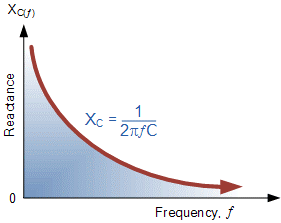

### Introduction

A series resonant circuit is an electrical circuit consisting of a resistor (R), inductor (L), and capacitor (C) connected in series. Resonance occurs when the inductive reactance (XL) and capacitive reactance (XC) are equal in magnitude but opposite in phase, effectively cancelling each other out. As a result, the circuit's impedance becomes purely resistive at a specific frequency known as the resonant frequency (fr). At this point, the impedance reaches its lowest value, allowing the current to reach its maximum.  

 

 
Fig.1 Series RLC circuit
 

### Resonance Condition

Resonance in a series RLC circuit happens when:
    
 XL=XC
 

Since the inductive reactance is given by:
      
 XL=&#x3C9;L
 

and the capacitive reactance is:

 $X_C=\frac{1}{\omega C}$ 

Setting them equal to each other: 

$ \omega_C=\frac{1}{\omega C}$

Solving for the angular frequency($\omega$):

$\omega^2  = \frac{1}{LC}$

$\omega=\frac{1}{\sqrt LC}$ 

since the angular frequency is related to the resonance frequency($f_r$) by:  

 $ \omega= 2{\pi f_r}$  

 The resonance frequency is given by:

 

 $ f_r=\frac {1} {2\pi\sqrt LC}$ 

 

### Inductive Reactance against Frequency 

 

Fig.2 Inductive reactance vs Frequency  
 

The graph of inductive reactance against frequency is a straight-line curve. The inductive reactance of an inductor increases linearly as the frequency across it increases. Therefore, inductive reactance is positive and directly proportional to frequency($X_L \propto f$) 

The same principle applies to capacitive reactance but in the opposite manner. If either the frequency or capacitance increases, the overall capacitive reactance decreases. As the frequency approaches infinity, the capacitor's reactance decreases to nearly zero, causing it to behave like a perfect conductor with 0 Ω resistance.  

Conversely, as the frequency approaches zero (DC level), the capacitor's reactance increases rapidly toward infinity, making it behave like a large resistance, similar to an open circuit. This indicates that capacitive reactance is inversely proportional to frequency for any given capacitance value, as illustrated in Fig. 3. 

### Capacitive Reactance against Frequency

  

 Fig.3 Capacitive reactance vs Frequency 
  

The graph of capacitive reactance against frequency is a hyperbolic curve. The Reactance of a capacitor is very high value at low frequencies but decreases rapidly as the frequency increases. Therefore, capacitive reactance is negative and inversely proportional to frequency (XC ∝ ƒ -1). 

We can see that the values of reactance depend on the frequency of the supply. At higher frequencies, $X_L$ is high, whereas at lower frequencies, $X_C$ is high. This implies that there must be a specific frequency at which $X_L$ is equal to $X_C$.  

If we now overlay the inductive reactance curve on top of the capacitive reactance curve, aligning them on the same axes, the point of intersection represents the series resonance frequency ($f_r or \omega_r$) as shown below.

  

 Fig.4 Reactance vs Resonance frequency 
 

<b>Quality Factor (Q) and Bandwidth (Δf)</b>

<b>Quality Factor(Q-Factor)</b>

The Q-factor measures the sharpness of resonance and is defined as: 

$ Q=\frac {\omega_r L}  {R}= \frac{1}{\omega_r CR}$

For a series RLC circuit, the Q-factor can also be expressed as: 

$  Q=\frac {X_L}{R} = \frac {1}{R}\frac {\sqrt L}{C} $

<b>High Q-factor:</b> Narrow bandwidth,sharp resonance. 
<b>Low Q-factor:</b> Wider bandwidth, less sharp resonance.

<b>Bandwidth(Δf)</b> 

The bandwidth is the range of frequencies over which the circuit effectively responds and is defined as: 

$ Δf = f_L−f_H$  

Where, 
•	$f_L$ = Lower cutoff frequency (where the amplitude drops to 1/root 2 or -3 dB below peak). 
•	$f_H$ = Upper cutoff frequency (similarly, where amplitude drops by -3 dB). 
•	$f_r$ = Resonant frequency, located at the peak of the curve. 

$ Δf=\frac {f_r}{Q}$

A higher Q-factor results in a smaller bandwidth, making the circuit more frequency-selective.

  
 

 Fig.5 Resonance Curve 
 

<b>Applications of resonance in RLC circuits</b>  
1.<b>Radio and TV Tuners:</b> Used in tuning circuits to select specific frequencies.  
2.<b>Filters and Oscillators:</b> Essential in designing band-pass filters and frequency-selective networks.  
3.<b>Wireless Power Transfer:</b> Resonant circuits improve efficiency in wireless energy transfer applications.

 